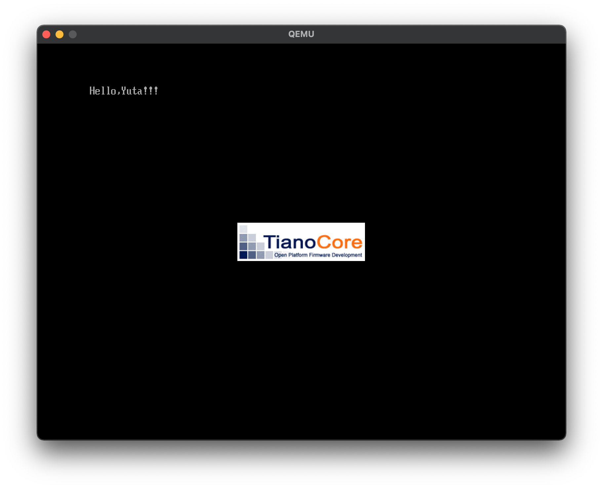

# mikanOS on Mac
ゼロからのOS自作入門　[内田公太・著] をMacでやろう!


# 環境
- MacBook Air (2020 Intel)
- macOS Big Sur 11.2.3


# 参考サイト (ほぼ参考サイト通りにやってます)
- [Mac で始める「ゼロからのOS自作入門」](https://qiita.com/yamoridon/items/4905765cc6e4f320c9b5)
- [MacでゼロからのOS自作入門をゼロから勉強中 - Zenn](https://zenn.dev/karaage0703/scraps/b2705131673377)

# 環境構築
### EDK II
```sh
$ cd $HOME
$ git clone https://github.com/tianocore/edk2.git
$ cd edk2
$ git checkout 38c8be123aced4cc8ad5c7e0da9121a181b94251
$ git submodule init
$ git submodule update
$ cd BaseTools/Source/C
$ make
```

### mikanos-build リポジトリの準備
```sh
$ cd $HOME
$ git clone https://github.com/uchan-nos/mikanos-build.git osbook
$ cd osbook/devenv
$ curl -L https://github.com/uchan-nos/mikanos-build/releases/download/v2.0/x86_64-elf.tar.gz | tar xz
$ cd ..
```

次の内容の mac.patch というファイルを作る
```sh
--- a/devenv/make_image.sh
+++ b/devenv/make_image.sh
@@ -23,11 +23,24 @@ qemu-img create -f raw $DISK_IMG 200M
 mkfs.fat -n 'MIKAN OS' -s 2 -f 2 -R 32 -F 32 $DISK_IMG

 $DEVENV_DIR/mount_image.sh $DISK_IMG $MOUNT_POINT
-sudo mkdir -p $MOUNT_POINT/EFI/BOOT
-sudo cp $EFI_FILE $MOUNT_POINT/EFI/BOOT/BOOTX64.EFI
+if [ `uname` = 'Darwin' ]; then
+    mkdir -p $MOUNT_POINT/EFI/BOOT
+    cp $EFI_FILE $MOUNT_POINT/EFI/BOOT/BOOTX64.EFI
+else
+    sudo mkdir -p $MOUNT_POINT/EFI/BOOT
+    sudo cp $EFI_FILE $MOUNT_POINT/EFI/BOOT/BOOTX64.EFI
+fi
 if [ "$ANOTHER_FILE" != "" ]
 then
-    sudo cp $ANOTHER_FILE $MOUNT_POINT/
+    if [ `uname` = 'Darwin' ]; then
+        cp $ANOTHER_FILE $MOUNT_POINT/
+    else
+        sudo cp $ANOTHER_FILE $MOUNT_POINT/
+    fi
 fi
 sleep 0.5
-sudo umount $MOUNT_POINT
+if [ `uname` = 'Darwin' ]; then
+    hdiutil detach $MOUNT_POINT
+else
+    sudo umount $MOUNT_POINT
+fi
diff --git a/devenv/mount_image.sh b/devenv/mount_image.sh
index ba8233e..aea4d7d 100755
--- a/devenv/mount_image.sh
+++ b/devenv/mount_image.sh
@@ -16,5 +16,9 @@ then
     exit 1
 fi

-mkdir -p $MOUNT_POINT
-sudo mount -o loop $DISK_IMG $MOUNT_POINT
+if [ `uname` = 'Darwin' ]; then
+    hdiutil attach -mountpoint $MOUNT_POINT $DISK_IMG
+else
+    mkdir -p $MOUNT_POINT
+    sudo mount -o loop $DISK_IMG $MOUNT_POINT
+fi
```

patchコマンドを実行してパッチを適用する
```sh
$ patch -p1 < mac.patch
```
とのことだったが, 実行すると
```sh
patch: **** out of memory
```
となった. そのため, 諦めて手作業でパッチを当てた.


### QUEMのインストール
```sh
$ brew install qemu
```


### LLVMのインストール
```sh
$ brew install llvm@9
$ export PATH=/usr/local/opt/llvm@9/bin:$PATH (.zshrcにも書き込む)
```
インストールが上手くいかなかった. 先に
```sh
$ xcode-select --install
```
を行うとインストールすることができた.


### その他のビルドに必要なパッケージのインストール
```sh
$ brew install nasm dosfstools binutils
$ export PATH=/usr/local/opt/binutils/bin:$PATH
```


### バイナリエディタ「0xED」のインストール
```sh
$ brew install 0xed
```
実行すると, 「そんなのないよ」と言われたので, 代わりにApp Storeから `Hex Fiend` をインストール. 


# 1章
## Hello, World!

### ダウンロード
mikanos-build リポジトリから
- `day01/bin/hello.efi`(バイナリコード)
- `devenv/OVMF_CODE.fd`
- `devenv/OVMF_VARS.fd`  
を持ってくる.  
hello.efiを一部変更すれば'Hello, World!' 以外の文字を出力できる.  
UEFIブートするためには, OVMFファイルというのが必要らしい(*.fdのやつ). 

```sh
$ curl -O https://raw.githubusercontent.com/uchan-nos/mikanos-build/master/day01/bin/hello.efi
$ curl -O https://raw.githubusercontent.com/uchan-nos/mikanos-build/master/devenv/OVMF_CODE.fd
$ curl -O https://raw.githubusercontent.com/uchan-nos/mikanos-build/master/devenv/OVMF_VARS.fd
```


### イメージを作ってFATでフォーマット
```sh
$ qemu-img create -f raw mikan.img 200M
$ mkfs.fat -n 'MIKAN_OS' -s 2 -f 2 -R 32 -F 32 mikan.img
```

### イメージをマウントして, バイナリファイルを書き込んで, アンマウント
```sh
$ hdiutil attach -mountpoint mnt mikan.img
$ mkdir -p mnt/EFI/BOOT
$ cp hello.efi mnt/EFI/BOOT/BOOTX64.EFI
$ hdiutil detach mnt
```


### バイナリファイルを書き込んだイメージをQEMUで読み込み, 起動する
```sh
$ qemu-system-x86_64 -drive if=pflash,file=OVMF_CODE.fd -drive if=pflash,file=OVMF_VARS.fd -hda mikan.img
```




実行するとQEMUにカーソルを奪われるが, Macなら `Control + Option + g` でカーソルが戻ってくる. おかえり. 


### 自動化
[karaage0703さん](https://zenn.dev/karaage0703/scraps/b2705131673377)がMac用にパッチを当てたリポジトリを用意してくれている. (patchコマンドを実行したのなら, このgit clone は必要ないかも)
```sh
$ git clone -b karaage https://github.com/karaage0703/mikanos-build osbook
```

以下のスクリプト実行すると, ここまでの作業を実行してくれる. これからはこれを使おう. 
```sh
$ ~/osbook/devenv/run_qemu.sh hello.efi
```


# 2章
## EDK II でハローワールド

```sh
$ git clone https://github.com/uchan-nos/mikanos.git
$ cd mikanos
$ git checkout osbook_day02a

$ cd ~/edk2
$ ln -s ~/mikanos/MikanLoaderPkg ./

$ source edksetup.sh
```

Conf/target.txt ファイルを変更する(`TOOL_CHAIN_TAG`は本と異なる)
| 項目            | 値                                |
|:----------------|:----------------------------------|
| ACTIVE_PLATFORM | MikanLoaderPkg/MikanLoaderPkg.dsc |
| TARGET          | DEBUG                             |
| TARGET_ARCH     | X64                               |
| TOOL_CHAIN_TAG  | CLANGPDB                          |


ビルドして実行
```sh
$ cd ~/edk2
$ build
$ cd Build/MikanLoaderX64/DEBUG_CLANGPDB/X64
$ ~/osbook/devenv/run_qemu.sh Loader.efi
```


## メモリマップの取得
ビルド
```sh
$ cd ~/mikanos
$ git checkout osbook_day02b
$ cd ~/edk2
$ source edksetup.sh
$ build
```

QEMU起動
```sh
$ cd Build/MikanLoaderX64/DEBUG_CLANGPDB/X64
$ ~/osbook/devenv/run_qemu.sh Loader.efi
```

マウント
```sh
$ mkdir -p mnt
$ hdiutil attach -mountpoint mnt disk.img
```

中身の確認 & アンマウント
```sh
$ ls mnt
$ cat mnt/memmap
$ hdiutil detach mnt
```

memmapの中見はこんな感じ
```
Index, Type, Type(name), PhysicalStart, NumberOfPages, Attribute
0, 3, EfiBootServicesCode, 00000000, 1, F
1, 7, EfiConventionalMemory, 00001000, 9F, F
2, 7, EfiConventionalMemory, 00100000, 700, F
3, A, EfiACPIMemoryNVS, 00800000, 8, F
4, 7, EfiConventionalMemory, 00808000, 8, F
5, A, EfiACPIMemoryNVS, 00810000, F0, F
6, 4, EfiBootServicesData, 00900000, B00, F
7, 7, EfiConventionalMemory, 01400000, 3AB36, F
                      ...
                      ...
                      ...
```


# 3章
## QEMUモニタ

CPUのレジスタ値を確認する
```
(qemu) info registers
RAX=0000000000000000 RBX=0000000000000001 RCX=000000003fb7b1c0 RDX=0000000000000031
RSI=0000000000000400 RDI=000000003fea92d0 RBP=000000000000002e RSP=000000003fea88a0
R8 =0000000000000000 R9 =000000003fecc30f R10=0000000000000050 R11=0000000000000000
R12=000000003e6965c0 R13=000000003fea8930 R14=000000003f226920 R15=000000003fea88e8
RIP=000000003e69651b RFL=00000206 [-----P-] CPL=0 II=0 A20=1 SMM=0 HLT=0
ES =0030 0000000000000000 ffffffff 00cf9300 DPL=0 DS   [-WA]
                      ...
                      ...
                      ...
```

指定したアドレス付近の値を表示（メモリダンプ）する. おそらく環境の違いによるものだと思うが, 本に載っていたアドレスをそのまま使うと上手くいかなかった. そこでレジスタ値確認のときに出てきた `RIP` の値を使うことにした. 
```
(qemu) x /4xb 0x03e69651b
000000003e69651b: 0xeb 0xfe 0x48 0x83
```

jmp命令は本と同じだが, その後の命令が本とは違うものになっている. (本では `xchg %ax, %ax`)
```
(qemu) x /2i 0x03e69651b
0x3e69651b:  eb fe                    jmp      0x3e69651b
0x3e69651d:  48 83 ec 28              subq     $0x28, %rsp
```


